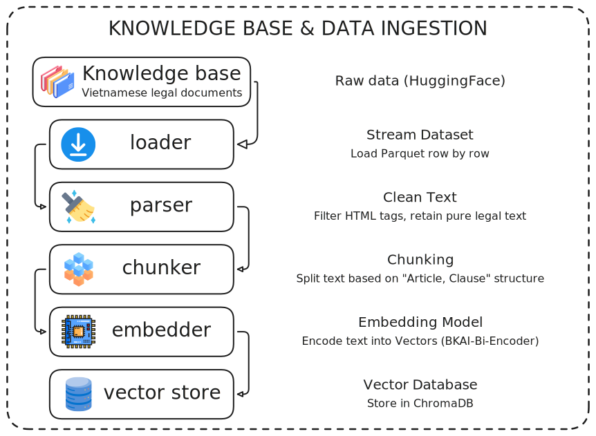
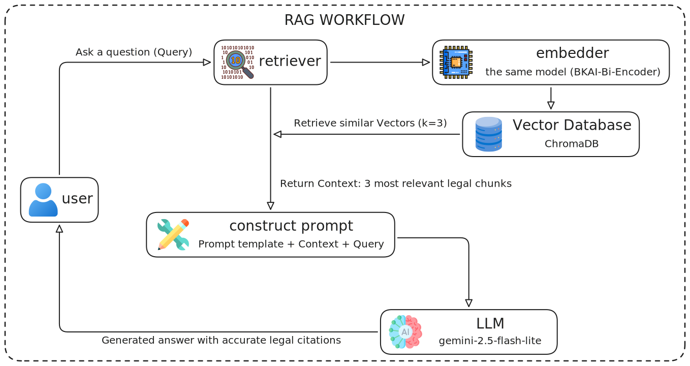

# ⚖️ Trợ Lý RAG Pháp Luật Việt Nam

Dự án xây dựng hệ thống Hỏi - Đáp (QA) Pháp luật Việt Nam sử dụng kiến trúc **RAG (Retrieval-Augmented Generation)**. Hệ thống được phát triển trên nền tảng **LangChain**, sử dụng **ChromaDB** để lưu trữ vector và **Google Gemini** làm Mô hình Ngôn ngữ Lớn (LLM) để tổng hợp câu trả lời.

---

## 👷🏻‍♀️ Kiến trúc
### 1. Knowledge base & data ingestion


### 2. RAG workflow


---

## 📂 Cấu trúc thư mục

Dự án được thiết kế theo dạng mô-đun (modular), chia tách rõ ràng giữa quá trình xử lý dữ liệu (Data Ingestion) và quá trình truy xuất hỏi đáp (RAG Engine).

```text
VN_legal_RAG/
├── data_ingestion/          # MODULE 1: Xử lý dữ liệu & Indexing (Tạo Knowledge Base)
│   ├── chunker.py           # Cắt văn bản theo cấu trúc pháp luật (ưu tiên cắt theo Điều, Khoản)
│   ├── embedder.py          # Khởi tạo mô hình Embedding (bkai-foundation-models/vietnamese-bi-encoder)
│   ├── loader.py            # Tải dataset trực tiếp từ HuggingFace (bypass lỗi tràn RAM)
│   ├── parser.py            # Làm sạch HTML, loại bỏ thẻ script/style, trích xuất text
│   ├── vector_store.py      # Khởi tạo và cấu hình ChromaDB
│   └── main.py              # Script chính để chạy toàn bộ pipeline Ingestion theo batch
│
├── db_storage/              # Thư mục chứa Database (Được tạo tự động sau khi chạy main.py)
│   ├── b102dbe5-.../        # Các file Parquet chứa vector dữ liệu
│   └── chroma.sqlite3       # File SQLite lưu trữ Metadata
│
├── rag_engine/              # MODULE 2: Truy xuất & Sinh câu trả lời (RAG)
│   ├── chain.py             # Xây dựng Pipeline RAG bằng LangChain LCEL (Kết hợp Retriever + Prompt + LLM)
│   ├── llm.py               # Khởi tạo kết nối với Google Gemini API
│   └── retriever.py         # Cấu hình ChromaDB thành công cụ tìm kiếm (Retriever)
│
├── .env                     # File ẩn chứa biến môi trường (Google API Key)
├── app.py                   # Giao diện Web tương tác bằng Streamlit
├── requirements.txt         # Danh sách các thư viện cần cài đặt
└── test_retrieval.py        # Script test nhanh khả năng tìm kiếm của Vector DB trên Terminal
```

---

## 🚀 Hướng dẫn cài đặt và chạy hệ thống

### Bước 1: Thiết lập môi trường (Environment Setup)
1. Mở Terminal (Command Prompt / PowerShell) tại thư mục gốc của dự án (`VN_legal_RAG/`).
2. Tạo môi trường ảo (Virtual Environment):
   ```bash
   python -m venv .venv
   ```
3. Kích hoạt môi trường ảo:
   * Trên **Windows**: `.\.venv\Scripts\activate`
   * Trên **Mac/Linux**: `source .venv/bin/activate`
4. Cài đặt các thư viện cần thiết:
   ```bash
   pip install -r requirements.txt
   ```

### Bước 2: Cấu hình API Key
1. Truy cập [Google AI Studio](https://aistudio.google.com/) và tạo một API Key miễn phí.
2. Tại thư mục gốc của dự án, tạo một file có tên là `.env`.
3. Mở file `.env` và thêm dòng sau:
   ```text
   GOOGLE_API_KEY=<api_key_vừa_tạo>
   ```

---

## ⚙️ Quy trình thực thi hệ thống

Hệ thống hoạt động qua 2 giai đoạn chính. Nếu đã hoàn thành Giai đoạn 1 và có sẵn thư mục `db_storage` thì những lần sau có thể bỏ qua Giai đoạn 1 và đi thẳng đến Giai đoạn 2.

### Giai đoạn 1: Xây dựng Cơ sở tri thức (Data Ingestion)
Quá trình này sẽ tải văn bản luật từ HuggingFace, làm sạch, cắt nhỏ, nhúng (embed) thành vector và lưu xuống ổ cứng.

1. Chạy lệnh sau trong Terminal:
   ```bash
   python data_ingestion/main.py
   ```
2. **Lưu ý:** Quá trình này chạy bằng CPU nên sẽ tốn thời gian tùy thuộc vào số lượng văn bản (`max_docs`) được cấu hình trong `main.py`. Bấm `Ctrl + C` để dừng lại bất cứ lúc nào, dữ liệu đã chạy sẽ được lưu an toàn tại thư mục `db_storage/`.

*(Tùy chọn) Kiểm tra chất lượng tìm kiếm:*
Chạy file test để xem ChromaDB có trả về đúng các điều luật liên quan hay không:
```bash
python test_retrieval.py
```

### Giai đoạn 2: Khởi chạy Giao diện Hỏi Đáp (RAG Application)
Khi Database đã sẵn sàng, chúng ta kết nối với LLM (Gemini) và khởi chạy giao diện Web.

1. Chạy lệnh sau để khởi động Streamlit:
   ```bash
   streamlit run app.py
   ```
2. Trình duyệt sẽ tự động mở lên tại địa chỉ `http://localhost:8501`.
3. **Sử dụng:** Nhập các câu hỏi liên quan đến pháp luật (VD: *"Thời gian thử việc của người lao động là bao lâu?"*). Hệ thống sẽ tự động tra cứu trong `db_storage`, trích xuất các điều luật liên quan và yêu cầu Gemini tổng hợp thành câu trả lời dễ hiểu, có kèm theo nguồn trích dẫn chi tiết.

---